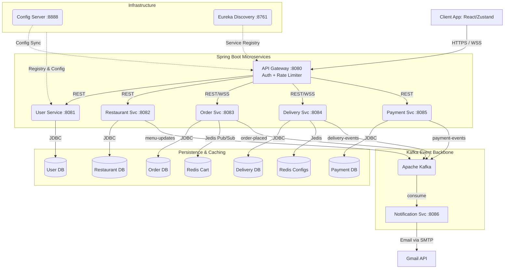
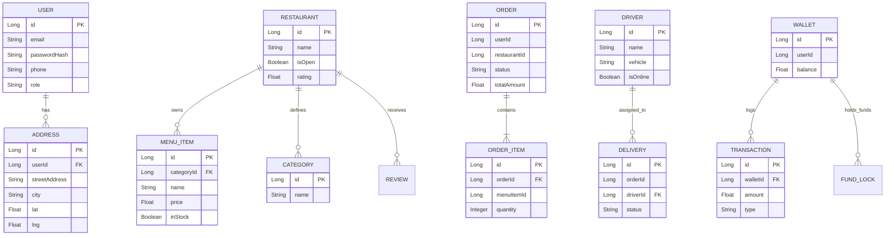
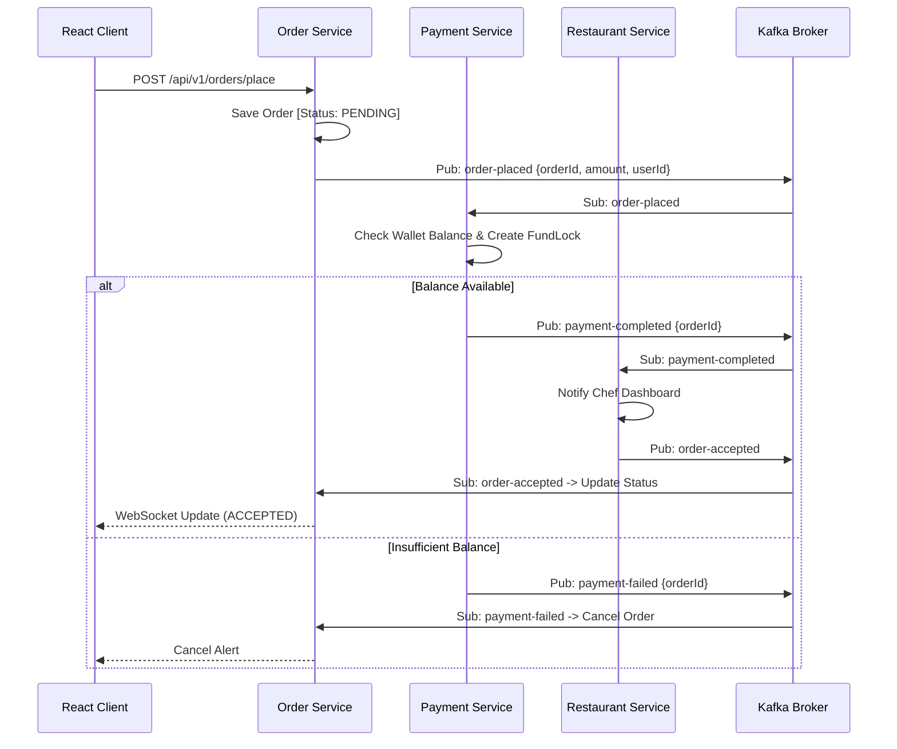

# 🍔 FoodRush — Ultimate Enterprise Food Delivery Platform

> **Event-Driven Microservices Architecture** | Java 21 + Spring Boot 3 + Kafka + Redis + MySQL + React 18
> This is the complete, definitive technical documentation for the FoodRush project.

FoodRush handles the entire lifecycle of a massively scaled modern food delivery application. It is engineered to mimic high-throughput production systems, relying heavily on fully decoupled microservices, distributed SAGA choreography, and real-time WebSockets to deliver an unparalleled smooth experience for Users, Restaurants, and Drivers.

---

## 🌟 1. System Highlights & Core Features

| Feature | Description | Engine / Technology |
|---|---|---|
| 🧠 **AI Smart Order Prediction** | Uses historical order data, time of day, and Gemini AI predictions to suggest the perfect meal automatically. | Google Gemini API + Core Backend |
| 👥 **Group Orders with Live Split** | Users can share a "Group Cart Link". Multiple clients connect via WSS and add items. The cart dynamically splits the final bill. | WebSockets (STOMP) + Redis (Pub/Sub) |
| ⚡ **Dynamic Surge Pricing** | Recalculates delivery fees every 30 seconds based on live zone order velocity versus available driver density. | Redis Counters + Kafka Streams |
| 📍 **Sub-Second Driver Tracking** | Drivers pulse GPS coordinates which are fanned out to active consumer clients instantly, skipping the database layer entirely. | WebSockets + Redis Geospatial |
| 🔒 **High-Performance Gateways** | Stops DDoS and spam via distributed IP rate limiting at the perimeter, alongside stateless authentication token parsing. | Spring Cloud Gateway + Redis Lua Scripts|

---

## 🏗️ 2. High-Level Systems Architecture (HLD)

FoodRush implements a strict **Database-per-Service** design. Synchronous blocking calls (REST) are only used for client-facing queries. All mutating system states trigger asynchronous Domain Events over **Apache Kafka**.

### Architecture Diagram



---

## 🗄️ 3. Database Schemas (Entity Relationship)

Since every microservice maintains its own discrete database, foreign keys across domains do not exist. Instead, services reference each other via UUIDs/Long IDs.



---

## ⚙️ 4. System Distributed Workflows

### Checkout & Payment SAGA Choreography
No central orchestrator exists. Transactions are managed entirely by consuming and producing Kafka events. This protects against locking up the database during heavy usage.



---

## 💻 5. Frontend Architecture
The Frontend is built for maximum speed and component reuse, powered by **React 18** and **Vite**.

- **Styling**: `TailwindCSS v4` completely removes custom unmaintained CSS.
- **State Management**: Uses `Zustand`. Data is isolated into domain stores:
  - `authStore.js` (JWT & User Session)
  - `cartStore.js` (Cart states, syncs via Redis backed APIs)
  - `restaurantStore.js`, `orderStore.js`, `walletStore.js`, `addressStore.js`
- **Component Routing Structure**:
  - `HomePage.jsx` (Discovery / AI Prompts)
  - `SearchPage.jsx` & `RestaurantDetailPage.jsx` (Menu exploration)
  - `CheckoutPage.jsx` (SAGA trigger endpoint)
  - `OrderTrackingPage.jsx` (WebSocket Map integration)
  - `WalletPage.jsx` (Top-up logic)

---

## 🔌 6. Comprehensive API Endpoints Registry

Access all APIs over `http://localhost:8080/api/v1/...` passing `Authorization: Bearer <token>`.

| Domain | Method | Endpoint Path | System Action / Description |
|---|---|---|---|
| **Identity** | POST | `/auth/register` | Open route to register. Generates OTP. |
| | POST | `/auth/verify-otp` | Enables account. |
| | POST | `/auth/login` | Authenticates User/Driver and yields JWT. |
| **Profile**| GET | `/users/profile` | Yields current decoded user metadata. |
| | PUT | `/users/profile` | Update profile information. |
| | GET/POST | `/users/addresses` | Fetch or define geocoded physical addresses. |
| **Restaurant**| POST | `/restaurants` | Merchant app registration. |
| | GET | `/restaurants/nearby` | Geospatial lookup of restaurants < 5KM. |
| | GET | `/restaurants/{id}` | Read public storefront info. |
| | PATCH | `/restaurants/{id}/toggle`| Force manual close overrides. |
| **Menu**| GET | `/restaurants/{id}/menu/all`| Retrieves all mapped `MenuItem`s. |
| | POST/PUT | `/restaurants/{id}/menu/items`| Admin catalog modification. |
| **Cart** | POST | `/cart/add` | Commits changes to the Redis Session tier. |
| | DELETE | `/cart/remove/{id}` | Removes single cart item. |
| | GET | `/cart` | Fetches active cart payload. |
| **Order**| POST | `/orders/place` | **Initiates Financial SAGA**. |
| | GET | `/orders/{orderId}` | Poll for status. |
| | PATCH | `/orders/{id}/status` | Admin override order statuses. |
| | POST | `/restaurants/{id}/accept-order/{orderId}`| Sent by Restaurant CLI when cooking starts.|
| **Driver** | POST | `/driver/register` | Gig worker onboarding. |
| | POST | `/driver/go-online` | Tags driver as eligible for dispatch queue. |
| | POST | `/driver/location` | High-frequency GPS pump. Sent every 2s. |
| **Delivery**| GET | `/delivery/driver/active` | Fetch matched orders for standard dispatch. |
| | POST | `/delivery/pickup` | Scans package in-hand. |
| | POST | `/delivery/complete` | Proof of delivery, drops FundLock into wallet. |
| **Wallet** | POST | `/wallet/add-funds` | Top-ups user internal wallet balance. |
| | GET | `/wallet/balance` | Fetches integer precision balance. |
| | GET | `/transactions` | Paginated payment ledger history. |

---

## 📨 7. Kafka Message Topography

| Topic Identifier | Producer | Consumer | Data Payload Sent |
|---|---|---|---|
| `order-placed` | Order-Service | Payment, Notification | `{orderId, totalAmount, userId}` |
| `payment-completed`| Payment-Service | Order, Rest., Notification| `{orderId, walletTxnId}` |
| `payment-failed` | Payment-Service | Order, Notification | `{orderId, reason}` |
| `order-accepted` | Rest-Service | Order, Notification | `{orderId, estimatedPrepTime}` |
| `order-cancelled` | Any Service | Payment, Delivery, Notif | `{orderId, cancelledByRoleId}`|
| `driver-assigned` | Delivery-Service | Order, Notification | `{orderId, driverId, driverName}` |
| `delivery-picked-up`| Delivery-Service | Order, Notification | `{orderId}` |
| `delivery-completed`| Delivery-Service | Payment, Order | `{orderId, tipAmount}` |

---

## 🚀 8. Definitive Developer Setup Guide

Booting the entire distributed system locally requires specific strict sequences due to internal dependency checks (Eureka + Config Server).

### 🛠️ Prerequisites
- **Java 21**
- **Node.js 18+**
- **Docker Compose**

### Step 1. Clone & Configuration
```bash
git clone https://github.com/<your-username>/foodRush.git
cd foodRush

# Duplicate env file
cp .env.example .env
```
Inside `.env`, define your MySQL root variables, a secure `JWT_SECRET` (must be long), and `MAIL_PASSWORD` (App-password from Google if testing email notifications).

### Step 2. Fire Up the Base Infrastructure
Start Zookeeper, Kafka, and Redis (Requires Docker).
```bash
docker-compose up -d
```
*(Verify Kafka UI by visiting `http://localhost:8090`)*

### Step 3. Spin up Backend Microservices
Run these in separate terminal tabs in **EXACT** order. Wait for the port to bind before moving to the next.

```bash
# 1. Configuration Hub (Must be first)
cd Backened/config-server && ./gradlew bootRun

# 2. Service Discovery Mesh (Wait for config server)
cd Backened/discovery-server && ./gradlew bootRun

# 3. Core Domains (These can boot at the same time)
cd Backened/user-service        && ./gradlew bootRun
cd Backened/restaurant-service  && ./gradlew bootRun
cd Backened/order-service       && ./gradlew bootRun
cd Backened/delivery-service    && ./gradlew bootRun
cd Backened/payment-service     && ./gradlew bootRun
cd Backened/notification-service && ./gradlew bootRun

# 4. API Gateway (Must be LAST so routing paths to Eureka targets are valid)
cd Backened/api-gateway && ./gradlew bootRun
```

### Step 4. Database Seeding (Phase 2)
The database structure is dynamically created by Hibernate during boot. To inject test users and restaurants:
```bash
mysql -u root -p < phase2-seed.sql
```

### Step 5. Frontend UI
```bash
cd Frontend
npm install
npm run dev
```
Navigate to [http://localhost:5173](http://localhost:5173).

---

## 🔒 9. Security Principles
1. **Network Zero-Trust**: Direct web access to ports `8081-8086` is disallowed in production. The API Gateway `:8080` mediates all traffic.
2. **Stateless JWT**: Authentication creates completely stateless JWTs. No database check implies highly performant horizontal scaling. Token is parsed by API Gateway and forwarded downstream as `X-User-Id` headers.
3. **Pessimistic DB Locks**: Money moving between Users, Drivers, and App Revenue is locked at the SQL tier during mutations to definitively prevent duplicate charge errors.
