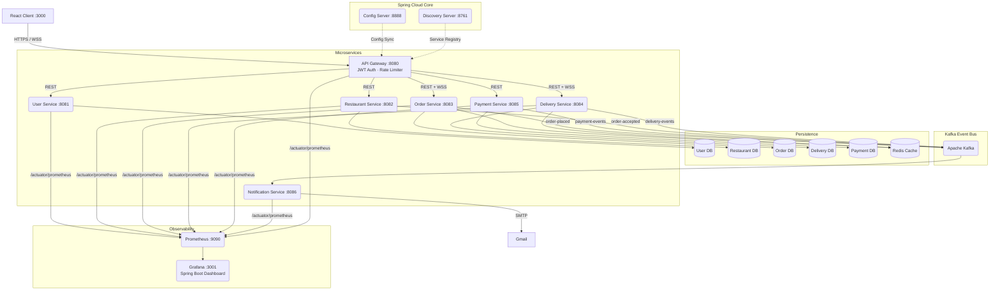
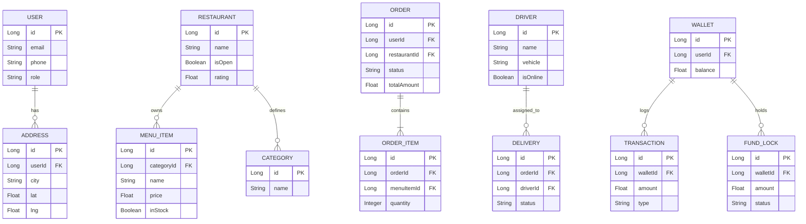
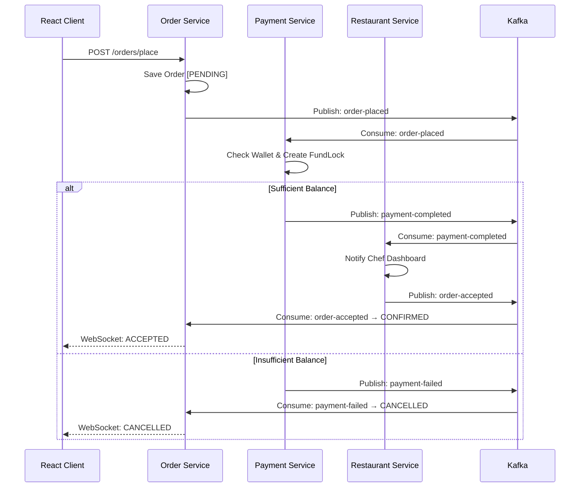
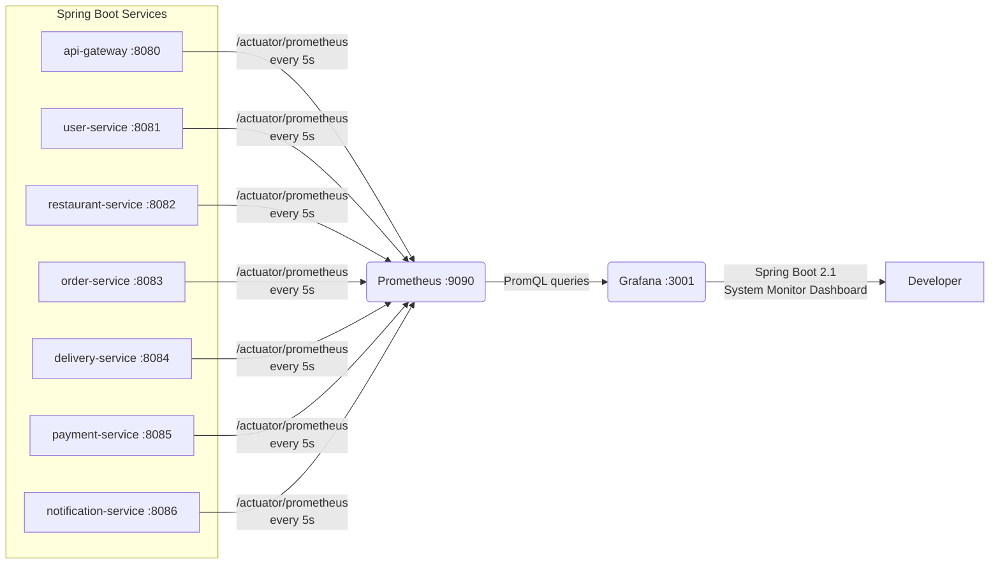

# 🍔 FoodRush

> **Production-Grade Event-Driven Microservices Platform**
> Java 21 · Spring Boot 3 · Kafka · Redis · MySQL · React 18 · Prometheus · Grafana

FoodRush is a fully containerized, cloud-ready food delivery platform built with a strict microservices architecture. Every service is independently deployable, observable, and scalable — backed by Kafka event choreography, distributed caching, real-time WebSockets, and a full observability stack.

---

## Table of Contents

1. [System Highlights](#system-highlights)
2. [High-Level Architecture](#high-level-architecture)
3. [Services Overview](#services-overview)
4. [Database Design](#database-design)
5. [Event-Driven Workflows](#event-driven-workflows)
6. [Observability Stack](#observability-stack)
7. [Frontend Architecture](#frontend-architecture)
8. [API Reference](#api-reference)
9. [Kafka Topics](#kafka-topics)
10. [Security Model](#security-model)
11. [Quick Start — Docker](#quick-start--docker-recommended)
12. [Manual Setup — Local Dev](#manual-setup--local-dev)

---

## System Highlights

| Feature | Description | Technology |
|---|---|---|
| 🧠 **AI Order Prediction** | Suggests meals based on history, time of day, and AI inference | Google Gemini API |
| 👥 **Group Orders & Live Bill Split** | Shared cart link; multiple users add items via WebSocket, auto-splits the bill | WebSockets (STOMP) + Redis Pub/Sub |
| ⚡ **Dynamic Surge Pricing** | Delivery fee recalculated every 30s based on zone order velocity vs. driver density | Redis Counters + Kafka Streams |
| 📍 **Sub-Second Driver Tracking** | GPS coordinates fanned out to consumers in real-time, bypassing the DB entirely | WebSockets + Redis Geospatial |
| 🔒 **Distributed Rate Limiting** | DDoS & spam protection via IP-level throttling at the gateway perimeter | Spring Cloud Gateway + Redis Lua |
| 📊 **Full Observability** | JVM metrics, CPU, heap, HTTP latency per service — all live in Grafana | Prometheus + Grafana |
| 💳 **SAGA Payment Choreography** | No central orchestrator; distributed transactions via Kafka events with compensating rollbacks | Apache Kafka |

---

## High-Level Architecture

FoodRush enforces **Database-per-Service** isolation. REST is used only for client-facing reads. All state mutations propagate as Domain Events over Kafka.



---

## Services Overview

| Service | Port | Responsibility |
|---|---|---|
| **api-gateway** | 8080 | Single entry point. JWT validation, rate limiting, routing |
| **config-server** | 8888 | Centralized config for all services via Spring Cloud Config |
| **discovery-server** | 8761 | Eureka service registry — enables dynamic load balancing |
| **user-service** | 8081 | Registration, OTP, login, JWT issuance, profile, addresses |
| **restaurant-service** | 8082 | Restaurant CRUD, menu management, geospatial nearby search |
| **order-service** | 8083 | Cart management (Redis), order placement, SAGA trigger |
| **delivery-service** | 8084 | Driver management, GPS tracking, delivery lifecycle |
| **payment-service** | 8085 | Wallet, fund locking, SAGA payment processing |
| **notification-service** | 8086 | Kafka consumer — sends emails via SMTP on key events |
| **prometheus** | 9090 | Scrapes `/actuator/prometheus` from all services every 5s |
| **grafana** | 3001 | Dashboards — JVM heap, CPU, uptime, HTTP metrics per service |

---

## Database Design

Each service owns its schema. Cross-domain references use shared IDs (no cross-DB foreign keys).



---

## Event-Driven Workflows

### Checkout & Payment SAGA

No central orchestrator. Distributed transactions are managed entirely through Kafka event choreography with compensating rollbacks on failure.



---

## Observability Stack

FoodRush ships with a **fully provisioned** monitoring stack. No manual setup required — dashboards auto-load on container start.

### What's monitored

Every Spring Boot service exposes `/actuator/prometheus`. Prometheus scrapes all 7 services every **5 seconds**. Grafana visualizes:

| Metric | Description |
|---|---|
| **Uptime / Start Time** | How long each service has been running |
| **JVM Heap & Non-Heap** | Memory pressure per service |
| **CPU Usage** | System + process CPU over time |
| **Load Average** | Host load (1m, 5m, 15m) |
| **Process Open Files** | File descriptor usage |
| **HikariCP Pool** | Database connection pool health |
| **JVM Thread Count** | Live, daemon, peak threads |
| **GC Activity** | Garbage collection pause times |

### Access

| Tool | URL | Credentials |
|---|---|---|
| Prometheus | http://localhost:9090 | — |
| Grafana | http://localhost:3001 | admin / admin |

### Architecture



### Provisioning (auto-loaded)

The Grafana dashboard and Prometheus datasource are provisioned automatically via Docker volumes:

```
grafana/
└── provisioning/
    ├── datasources/
    │   └── prometheus.yml       ← Prometheus datasource config
    └── dashboards/
        ├── dashboard.yml        ← Dashboard provider config
        └── spring-boot-dashboard.json  ← Spring Boot System Monitor
```

No manual import needed — just run `docker compose up` and navigate to http://localhost:3001.

---

## Frontend Architecture

Built with **React 18 + Vite** for maximum performance and developer velocity.

- **Styling**: TailwindCSS v4 — zero custom CSS files
- **State**: Zustand domain stores
  - `authStore.js` — JWT session & user context
  - `cartStore.js` — Cart state, Redis-backed sync
  - `restaurantStore.js` — Menu & restaurant discovery
  - `orderStore.js` — Order lifecycle & WebSocket updates
  - `walletStore.js` — Balance & transactions
  - `addressStore.js` — Geocoded delivery addresses
- **Key Pages**:
  - `HomePage.jsx` — Discovery & AI meal suggestions
  - `RestaurantDetailPage.jsx` — Menu exploration
  - `CheckoutPage.jsx` — SAGA payment trigger
  - `OrderTrackingPage.jsx` — Live driver map via WebSocket
  - `WalletPage.jsx` — Top-up and transaction history

---

## API Reference

All APIs are accessed via `http://localhost:8080/api/v1/...` with `Authorization: Bearer <token>`.

| Domain | Method | Endpoint | Description |
|---|---|---|---|
| **Auth** | POST | `/auth/register` | Register new user, triggers OTP |
| | POST | `/auth/verify-otp` | Verify OTP to activate account |
| | POST | `/auth/login` | Returns JWT token |
| **User** | GET | `/users/profile` | Get current user profile |
| | PUT | `/users/profile` | Update profile |
| | GET/POST | `/users/addresses` | Manage delivery addresses |
| **Restaurant** | POST | `/restaurants` | Register restaurant |
| | GET | `/restaurants/nearby` | Geospatial search within 5km |
| | GET | `/restaurants/{id}` | Get restaurant details |
| | PATCH | `/restaurants/{id}/toggle` | Open/close restaurant |
| **Menu** | GET | `/restaurants/{id}/menu/all` | Get full menu |
| | POST/PUT | `/restaurants/{id}/menu/items` | Add/update menu items |
| **Cart** | POST | `/cart/add` | Add item to Redis cart |
| | DELETE | `/cart/remove/{id}` | Remove item |
| | GET | `/cart` | Get current cart |
| **Orders** | POST | `/orders/place` | **Trigger payment SAGA** |
| | GET | `/orders/{orderId}` | Get order status |
| | PATCH | `/orders/{id}/status` | Admin status override |
| **Driver** | POST | `/driver/register` | Driver onboarding |
| | POST | `/driver/go-online` | Mark driver available |
| | POST | `/driver/location` | Push GPS coordinate (every 2s) |
| **Delivery** | GET | `/delivery/driver/active` | Get assigned orders |
| | POST | `/delivery/pickup` | Confirm package picked up |
| | POST | `/delivery/complete` | Complete delivery, release funds |
| **Wallet** | POST | `/wallet/add-funds` | Top up wallet |
| | GET | `/wallet/balance` | Get current balance |
| | GET | `/transactions` | Paginated transaction history |

---

## Kafka Topics

| Topic | Producer | Consumers | Payload |
|---|---|---|---|
| `order-placed` | Order Service | Payment, Notification | `{orderId, totalAmount, userId}` |
| `payment-completed` | Payment Service | Order, Restaurant, Notification | `{orderId, walletTxnId}` |
| `payment-failed` | Payment Service | Order, Notification | `{orderId, reason}` |
| `order-accepted` | Restaurant Service | Order, Notification | `{orderId, estimatedPrepTime}` |
| `order-cancelled` | Any Service | Payment, Delivery, Notification | `{orderId, cancelledBy}` |
| `driver-assigned` | Delivery Service | Order, Notification | `{orderId, driverId, driverName}` |
| `delivery-picked-up` | Delivery Service | Order, Notification | `{orderId}` |
| `delivery-completed` | Delivery Service | Payment, Order | `{orderId, tipAmount}` |

---

## Security Model

1. **Zero Direct Access** — Ports 8081–8086 are internal only. All traffic flows through the API Gateway on `:8080`.
2. **Stateless JWT** — Tokens are validated at the gateway and forwarded downstream as `X-User-Id` headers. No DB lookup per request.
3. **Pessimistic DB Locks** — All wallet mutations use SQL-level pessimistic locks to prevent double-spend race conditions.
4. **Redis Lua Rate Limiting** — Atomic scripts enforce per-IP request quotas at the gateway, preventing abuse before it hits any service.

---

## Quick Start — Docker (Recommended)

> ✅ **This is the easiest way to run FoodRush.** One command starts everything — all 7 Spring Boot services, Kafka, MySQL, Redis, Prometheus, and Grafana. No Java or Node.js installation needed.

### Prerequisites
- [Docker Desktop](https://www.docker.com/products/docker-desktop/) installed and running

---

### Step 1 — Clone & Configure

```bash
git clone https://github.com/shrey200634/foodRush.git
cd foodRush
```

Copy the example environment file:
```bash
# Mac/Linux
cp .env.example .env

# Windows PowerShell
Copy-Item .env.example .env
```

Open `.env` and fill in these values:
```env
DB_PASSWORD=yourpassword
JWT_SECRET=any-long-random-string-at-least-32-characters-long
MAIL_USERNAME=your@gmail.com
MAIL_PASSWORD=your-gmail-app-password
```

> 💡 **MAIL_PASSWORD** must be a [Gmail App Password](https://support.google.com/accounts/answer/185833), not your regular Gmail password. If you skip email features, you can leave these blank.

---

### Step 2 — Start the Entire Stack

```bash
docker compose up -d
```

Docker will automatically:
- Pull all required images
- Build your Spring Boot services from source
- Start everything in the correct dependency order (MySQL → Kafka → Config → Discovery → Services → Gateway)

⏳ **First run takes 3–5 minutes** (downloading images + building JARs). Subsequent starts are much faster.

---

### Step 3 — Check Everything is Running

```bash
docker compose ps
```

All containers should show `running`. Then open these URLs:

| Service | URL | Notes |
|---|---|---|
| 🌐 Frontend | http://localhost:3000 | Main app UI |
| 🔀 API Gateway | http://localhost:8080 | All API calls go here |
| 🔍 Eureka Dashboard | http://localhost:8761 | See all registered services |
| 📨 Kafka UI | http://localhost:8090 | Browse Kafka topics & messages |
| 📈 Prometheus | http://localhost:9090 | Raw metrics explorer |
| 📊 Grafana | http://localhost:3001 | Dashboards — login: `admin` / `admin` |

---

### Step 4 — Seed the Database

Load test data (restaurants, users, menu items):

```bash
# Mac/Linux
mysql -h 127.0.0.1 -P 3307 -u root -p < phase2-seed.sql

# Windows PowerShell
Get-Content phase2-seed.sql | docker exec -i mysql mysql -u root -prootpassword
```

---

### Step 5 — Stop Everything

```bash
docker compose down
```

To also delete all data (MySQL, Redis volumes):
```bash
docker compose down -v
```

---

### Troubleshooting

**Services not starting?**
```bash
# Check logs for a specific service
docker compose logs user-service --tail=50

# Restart a single service
docker compose restart user-service
```

**Port already in use?**
Make sure nothing else is running on ports: `3000`, `3001`, `3307`, `6379`, `8080`, `8090`, `8761`, `8888`, `9090`, `9092`

**Out of memory?**
In Docker Desktop → Settings → Resources → increase Memory to at least **6GB** (recommended 8GB for the full stack)

---


## Manual Setup — Local Dev

Use this if you want to run services outside Docker for faster iteration.

### Prerequisites

- Java 21
- Node.js 18+
- Docker (for infrastructure only)

### Step 1 — Start Infrastructure

```bash
docker compose up -d mysql redis zookeeper kafka kafka-ui prometheus grafana
```

### Step 2 — Start Services (in order)

```bash
# Terminal 1 — Config first
cd Backened/config-server && ./gradlew bootRun

# Terminal 2 — Discovery second
cd Backened/discovery-server && ./gradlew bootRun

# Terminals 3-8 — Core services (can run in parallel)
cd Backened/user-service        && ./gradlew bootRun
cd Backened/restaurant-service  && ./gradlew bootRun
cd Backened/order-service       && ./gradlew bootRun
cd Backened/delivery-service    && ./gradlew bootRun
cd Backened/payment-service     && ./gradlew bootRun
cd Backened/notification-service && ./gradlew bootRun

# Terminal 9 — Gateway last
cd Backened/api-gateway && ./gradlew bootRun
```

### Step 3 — Frontend

```bash
cd frontend
npm install
npm run dev
```

Open http://localhost:5173

---

## Project Structure

```
foodRush/
├── Backened/
│   ├── api-gateway/
│   ├── config-server/
│   │   └── src/main/resources/configurations/   ← Per-service YAMLs
│   ├── delivery-service/
│   ├── discovery-server/
│   ├── notification-service/
│   ├── order-service/
│   ├── payment-service/
│   ├── restaurant-service/
│   └── user-service/
├── frontend/                                     ← React 18 + Vite
├── grafana/
│   └── provisioning/
│       ├── dashboards/                           ← Auto-provisioned dashboard
│       └── datasources/                          ← Prometheus datasource
├── prometheus.yml                                ← Scrape config for all services
├── docker-compose.yml
├── phase2-seed.sql
└── .env.example
```

---

<p align="center">Built with ☕ Java, 🐘 Kafka, and way too many microservices.</p>
